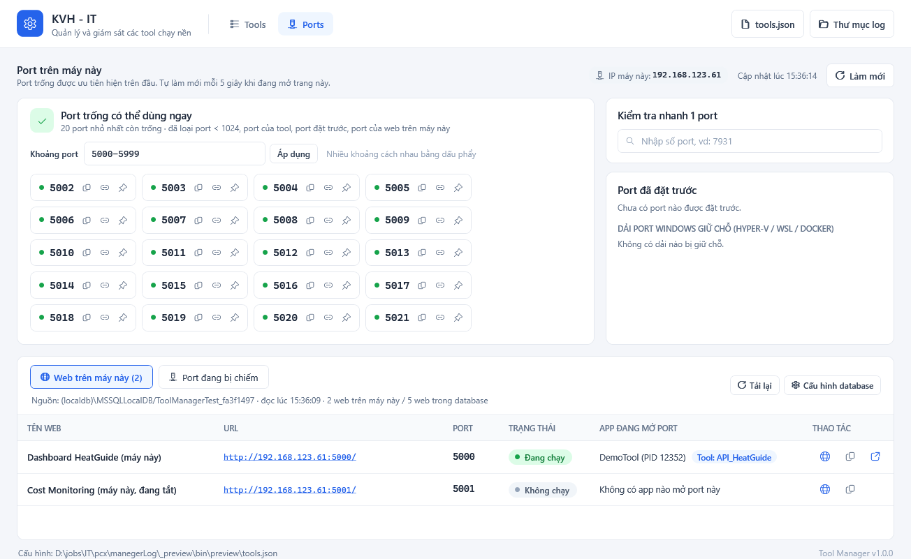
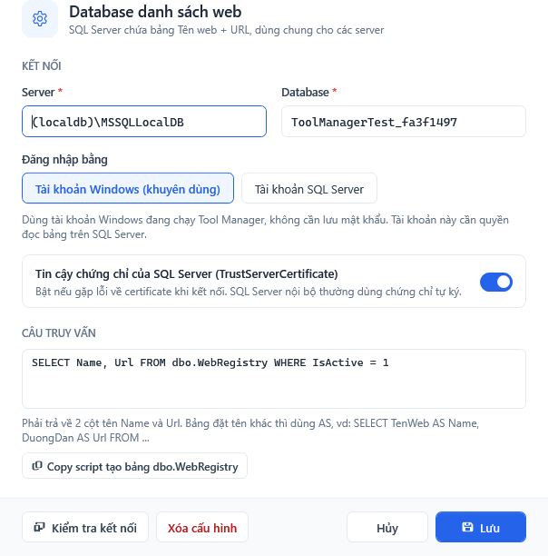

# Tool Manager

App WPF (.NET 8) quản lý nhiều tool console trong một cửa sổ: thêm tool (tên + file exe), bấm Start / Stop / Restart, xem log, tự chạy lại khi tool crash.




## Chạy

- Bản build sẵn: `publish\ToolManager.exe` (máy cần cài **.NET 8 Desktop Runtime**).
- Copy `ToolManager.exe` vào một thư mục cố định, ví dụ `E:\Source\ToolManager\`. Các file `tools.json` và `logs\` sẽ được tạo cạnh file exe.
- Tự chạy khi đăng nhập Windows: nhấn `Win + R`, gõ `shell:startup`, rồi tạo shortcut tới `ToolManager.exe` trong thư mục vừa mở. Các tool có tích "Tự chạy khi mở Tool Manager" sẽ tự start theo.

## Chức năng

| Chức năng | Ghi chú |
|---|---|
| Thêm / Sửa / Xóa tool | Double-click vào dòng để sửa. Xóa chỉ bỏ khỏi danh sách, không xóa exe hay log |
| Start / Stop / Restart | Stop sẽ kill cả tiến trình con của tool |
| Start / Stop tất cả | Trên thanh công cụ |
| Log | Hiển thị 2000 dòng gần nhất. Tô màu error, warn và thông báo hệ thống (`>>>`). Chọn dòng rồi Ctrl+C để copy |
| File log | `logs\<tên tool>\yyyy-MM-dd.log`, tự xóa file cũ hơn 30 ngày |
| Phát hiện lỗi trong log | Tool vẫn chạy nhưng log có lỗi thì hiện badge đỏ **"N lỗi"** cạnh trạng thái. Bấm vào badge để nhảy tới dòng lỗi gần nhất và đánh dấu đã xem. Dòng lỗi gồm: bắt đầu bằng `fail:` / `crit:` / `error:`, output stderr, có `Unhandled exception` hoặc `XxxException:`. Các dòng lỗi liền nhau trong 3 giây (stack trace) tính là 1 lỗi. Quy tắc nằm ở `ToolRunner.IsErrorLine` |
| Tự restart khi log có lỗi | Bật trong form Sửa tool, đặt số lỗi để restart (mặc định 1). Tool Manager chờ stack trace ghi xong (3 giây không có dòng lỗi mới) rồi mới dừng tool, sau đó chờ "N giây trước khi chạy lại" rồi start. Tối đa **3 lần trong 10 phút**; quá giới hạn thì chỉ báo lỗi, tool vẫn chạy. Bấm Start/Restart bằng tay sẽ tính lại giới hạn từ đầu |
| Tự chạy lại | Khi tool tự thoát thì chạy lại sau N giây. Nếu tool tắt **5 lần liên tiếp trong vòng 30 giây** sau khi chạy thì ngừng tự chạy lại để tránh vòng lặp |
| Chống tool "mồ côi" | Nếu Tool Manager bị tắt đột ngột (crash, End task) thì toàn bộ tool cũng dừng theo (Windows Job Object) |
| Chạy 1 bản duy nhất | Mở Tool Manager lần 2 từ cùng thư mục sẽ bị chặn |
| Port của tool | Khai báo trong form Sửa (vd `5044` hoặc `5044, 5045`). Khi bấm Start / Restart / Start tất cả mà port đang bị app khác chiếm hoặc nằm trong dải Windows giữ chỗ thì hỏi có chạy tiếp không. Tự chạy lại thì chỉ ghi cảnh báo vào log |

## Tab Ports

Chỉ xem port **trên máy đang chạy Tool Manager** (muốn xem server khác thì chạy Tool Manager trên server đó). Chỉ TCP. Tự làm mới mỗi 5 giây khi đang mở tab, chuyển tab không ảnh hưởng tool đang chạy.

| Khu vực | Ghi chú |
|---|---|
| Port trống có thể dùng ngay | 20 port nhỏ nhất còn trống trong khoảng port (mặc định `5000-5999`, nhập được nhiều khoảng). Đã loại: port < 1024, port đang mở, dải Windows giữ chỗ, port khai báo cho tool (kể cả tool đang tắt), port đặt trước. "Trống" = không có trong bảng port đang mở **và** bind thử thành công. Chỉ bind, không listen nên Windows Firewall không hỏi quyền. Nút: Copy port, Copy URL `http://<IP máy>:<port>`, Đặt trước |
| Kiểm tra nhanh 1 port | Gõ số port: Trống / Bận bởi app nào (PID, IP, có phải tool của Tool Manager) / Windows giữ chỗ / Đã đặt trước / Đã khai báo cho tool |
| Port đã đặt trước | Ghi chú port dành cho app nào, lưu trong `ports.json` cạnh exe |
| Dải Windows giữ chỗ | Hyper-V / WSL / Docker giữ cả dải port, không app nào mở được dù không ai dùng (`netsh int ipv4 show excludedportrange protocol=tcp`) |
| Port đang bị chiếm | Port, IP, app, PID, đường dẫn exe, đánh dấu tool của Tool Manager. Nút: mở thư mục exe, xem tool ở tab Tools, kết thúc app (hỏi xác nhận; tool của Tool Manager thì dừng qua Tool Manager; chặn tiến trình hệ thống / bảo mật / app trong thư mục Windows) |

Chạy bằng quyền thường: app chạy bằng admin/SYSTEM chỉ hiện tên, không có đường dẫn exe và không kết thúc được. PID 4 "System" thường là HTTP.sys (IIS hoặc app dùng http.sys).

### Web trên máy này (đọc từ SQL Server)



- Một bảng **Tên web + URL** trên SQL Server dùng chung cho mọi server. Script tạo bảng + dữ liệu mẫu: [docs/web-registry.sql](docs/web-registry.sql) (hoặc nút "Copy script tạo bảng" trong form cấu hình).
- Tab Ports > **Web trên máy này**: chỉ hiện web có IP / tên máy trong URL trùng với máy đang chạy Tool Manager (so với mọi IP của máy). Mỗi web hiện port, trạng thái **Đang chạy / Không chạy** (port có app nào đang mở không), app đang mở port (đánh dấu nếu là tool của Tool Manager). Nút: mở web bằng trình duyệt, copy URL, xem tool.
- Không có web nào khớp: báo "Không có web nào trên máy này". Chưa cấu hình / lỗi kết nối: hiện thông báo + nút "Cấu hình database".
- Port của web trên máy này (kể cả web đang tắt) **không được gợi ý là port trống**.
- Đọc database khi mở tab Ports, sau đó tối đa 60 giây / lần (bấm "Tải lại" để đọc ngay).
- Cấu hình: nút **Cấu hình database**. Nên dùng **tài khoản Windows** (không lưu mật khẩu, tài khoản cần quyền `SELECT` trên bảng). Dùng tài khoản SQL thì mật khẩu không hiện lại trên form; chuỗi kết nối lưu trong `ports.json` đã **mã hóa Windows DPAPI** (chỉ tài khoản Windows đó trên máy đó giải mã được; copy `ports.json` sang máy khác phải cấu hình lại).
- Câu truy vấn mặc định `SELECT Name, Url FROM dbo.WebRegistry WHERE IsActive = 1`, sửa được. Bảng có tên cột khác thì dùng `AS Name`, `AS Url`.

## Lưu ý

- **Đóng Tool Manager = dừng tất cả tool.** Khi đóng, app sẽ hỏi xác nhận.
- Tool có `Console.ReadKey()` sẽ lỗi khi chạy ẩn. `Console.ReadLine()` sẽ treo chờ mãi. Nên bỏ các lệnh "Press any key...".
- App có giao diện (WPF/WinForms): bỏ tích "Ẩn cửa sổ cmd...". Vẫn Start/Stop được nhưng không có log.
- Log lỗi font tiếng Việt: đổi Encoding giữa UTF-8 và OEM trong form Sửa. Cách triệt để là thêm `Console.OutputEncoding = Encoding.UTF8;` vào đầu tool.
- Stop là kill ngay (không gửi Ctrl+C). Tool đang ghi dữ liệu dở sẽ bị cắt ngang.

## Build lại từ source

```bash
dotnet publish -c Release -r win-x64 --self-contained false -p:PublishSingleFile=true -p:IncludeNativeLibrariesForSelfExtract=true -o publish
```

## Cấu trúc code

- `Services/ToolRunner.cs`: lõi quản lý một tool (process, trạng thái, log, tự chạy lại)
- `Services/JobObject.cs`: gom các tool vào Job Object
- `Services/ConfigStore.cs`: đọc/ghi `tools.json`, `ports.json`, dọn log cũ
- `Services/PortService.cs`: đọc port đang mở (API `GetExtendedTcpTable`, giống `netstat -ano`), PID cha/con, thử bind, tìm port trống, dải Windows giữ chỗ
- `Services/WebRegistryService.cs`: đọc danh sách web từ SQL Server, lọc web của máy này, mã hóa chuỗi kết nối (DPAPI)
- `Views/PortsView.xaml`: tab Ports; `Views/PortReserveWindow.xaml`: hộp thoại đặt trước port; `Views/WebDbSettingsWindow.xaml`: cấu hình database
- `Themes/Light.xaml`: toàn bộ màu sắc, font và style (nút, ô nhập, công tắc, bảng, thanh cuộn, badge trạng thái). Muốn đổi màu chủ đạo thì sửa `AccentBrush`
- `Converters/`: tô màu dòng log, tách phần giờ trong log
- `MainWindow.xaml`: màn hình chính
- `ToolEditWindow.xaml`: form thêm/sửa tool
