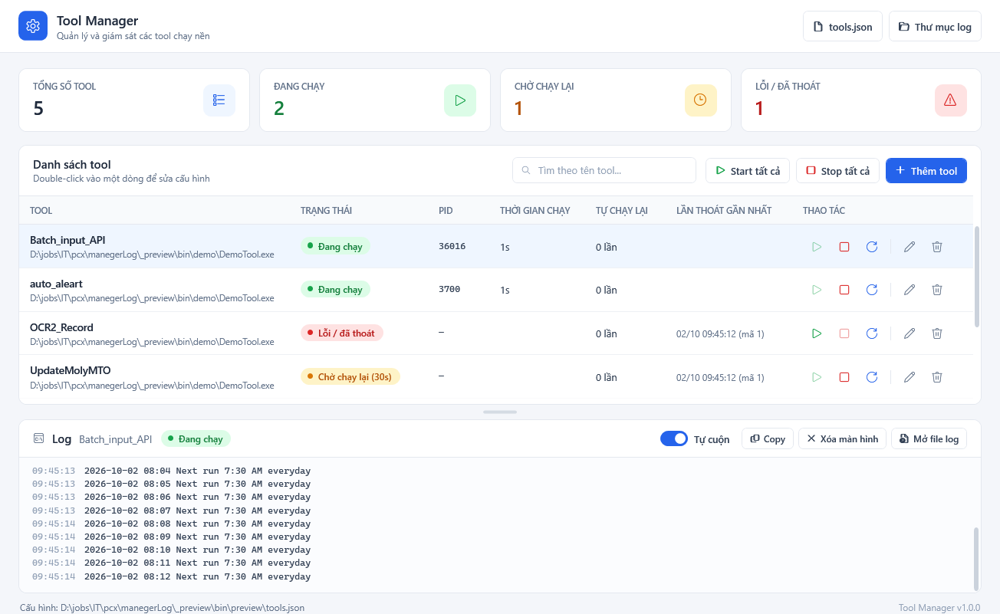
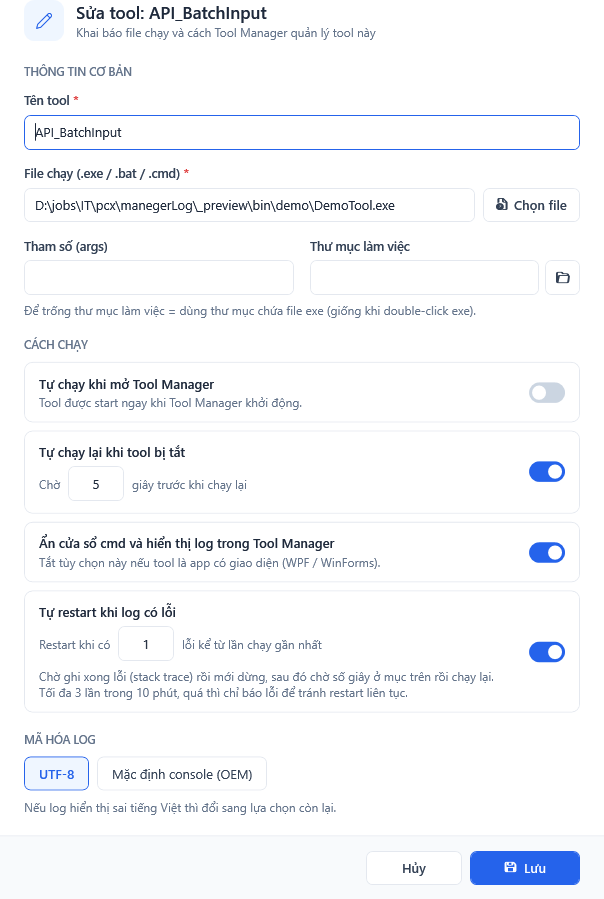

# Tool Manager

App WPF (.NET 8) quản lý nhiều tool console trong một cửa sổ: thêm tool (tên + file exe), bấm Start / Stop / Restart, xem log, tự chạy lại khi tool crash.





## Chạy

- Bản build sẵn: `publish\ToolManager.exe` (máy cần cài **.NET 8 Desktop Runtime**).
- Copy `ToolManager.exe` vào một thư mục cố định, ví dụ `E:\Source\ToolManager\`. Các file `tools.json` và `logs\` sẽ được tạo cạnh file exe.
- Tự chạy khi đăng nhập Windows: nhấn `Win + R`, gõ `shell:startup`, rồi tạo shortcut tới `ToolManager.exe` trong thư mục vừa mở. Các tool có tích "Tự chạy khi mở Tool Manager" sẽ tự start theo.

## Chức năng

| Chức năng | Ghi chú |
|---|---|
| Thêm / Sửa / Xóa tool | Double-click vào dòng để sửa. Xóa chỉ bỏ khỏi danh sách, không xóa exe hay log |
| Start / Stop / Restart | Stop sẽ kill cả tiến trình con của tool |
| Start / Stop tất cả | Trên thanh công cụ |
| Log | Hiển thị 2000 dòng gần nhất. Tô màu error, warn và thông báo hệ thống (`>>>`). Chọn dòng rồi Ctrl+C để copy |
| File log | `logs\<tên tool>\yyyy-MM-dd.log`, tự xóa file cũ hơn 30 ngày |
| Phát hiện lỗi trong log | Tool vẫn chạy nhưng log có lỗi thì hiện badge đỏ **"N lỗi"** cạnh trạng thái. Bấm vào badge để nhảy tới dòng lỗi gần nhất và đánh dấu đã xem. Dòng lỗi gồm: bắt đầu bằng `fail:` / `crit:` / `error:`, output stderr, có `Unhandled exception` hoặc `XxxException:`. Các dòng lỗi liền nhau trong 3 giây (stack trace) tính là 1 lỗi. Quy tắc nằm ở `ToolRunner.IsErrorLine` |
| Tự restart khi log có lỗi | Bật trong form Sửa tool, đặt số lỗi để restart (mặc định 1). Tool Manager chờ stack trace ghi xong (3 giây không có dòng lỗi mới) rồi mới dừng tool, sau đó chờ "N giây trước khi chạy lại" rồi start. Tối đa **3 lần trong 10 phút**; quá giới hạn thì chỉ báo lỗi, tool vẫn chạy. Bấm Start/Restart bằng tay sẽ tính lại giới hạn từ đầu |
| Tự chạy lại | Khi tool tự thoát thì chạy lại sau N giây. Nếu tool tắt **5 lần liên tiếp trong vòng 30 giây** sau khi chạy thì ngừng tự chạy lại để tránh vòng lặp |
| Chống tool "mồ côi" | Nếu Tool Manager bị tắt đột ngột (crash, End task) thì toàn bộ tool cũng dừng theo (Windows Job Object) |
| Chạy 1 bản duy nhất | Mở Tool Manager lần 2 từ cùng thư mục sẽ bị chặn |

## Lưu ý

- **Đóng Tool Manager = dừng tất cả tool.** Khi đóng, app sẽ hỏi xác nhận.
- Tool có `Console.ReadKey()` sẽ lỗi khi chạy ẩn. `Console.ReadLine()` sẽ treo chờ mãi. Nên bỏ các lệnh "Press any key...".
- App có giao diện (WPF/WinForms): bỏ tích "Ẩn cửa sổ cmd...". Vẫn Start/Stop được nhưng không có log.
- Log lỗi font tiếng Việt: đổi Encoding giữa UTF-8 và OEM trong form Sửa. Cách triệt để là thêm `Console.OutputEncoding = Encoding.UTF8;` vào đầu tool.
- Stop là kill ngay (không gửi Ctrl+C). Tool đang ghi dữ liệu dở sẽ bị cắt ngang.

## Build lại từ source

```bash
dotnet publish -c Release -r win-x64 --self-contained false -p:PublishSingleFile=true -o publish
```

## Cấu trúc code

- `Services/ToolRunner.cs`: lõi quản lý một tool (process, trạng thái, log, tự chạy lại)
- `Services/JobObject.cs`: gom các tool vào Job Object
- `Services/ConfigStore.cs`: đọc/ghi `tools.json`, dọn log cũ
- `Themes/Light.xaml`: toàn bộ màu sắc, font và style (nút, ô nhập, công tắc, bảng, thanh cuộn, badge trạng thái). Muốn đổi màu chủ đạo thì sửa `AccentBrush`
- `Converters/`: tô màu dòng log, tách phần giờ trong log
- `MainWindow.xaml`: màn hình chính
- `ToolEditWindow.xaml`: form thêm/sửa tool
